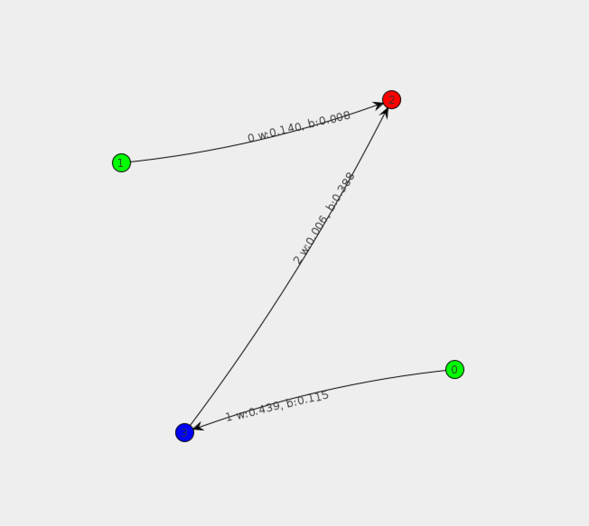

# Aim
The aim of this project was to build a general implementation of the Neuro-Evolution for Augmenting Topologies architecture that could be used to control an agent in a general game. The implementation of scoring for the game is outside the scope of this project, and should be created on a per-case basis. In my case this was the Scotland Yard board game.
# The NEAT Method

## Overview
The NEAT method is a reinforcement learning method that employs evolutionary algorithms to evolve both the structure and parameters of a neural network. NEAT is part of a wider field called Topology and Weight Evolving Artificial Neural Networks (TWEANNs). The core idea behind the NEAT method is to represent a neural network through a genome consisting of node genes and connection genes. These genomes evolve through mutation and crossover. In particular, there are 4 possible types of mutation: weight mutation, bias mutation, add connection mutation, and add node mutation. Two networks can reproduce to create further networks in a process called crossover. Crossover presents a difficult challenge called the Competing Conventions problem. The challenge of protecting new innovations is also core to the NEAT method.

## The Competing Conventions Problem
When genomes representing the same solution do not have the same encoding, crossover is likely to produce damaged offspring. In the case of natural organisms, if there were no indication of which gene is which, reproduction between two organisms would not succeed. Nature solves this problem through homology, whereby two genes are homologous if they are alleles of the same trait. To enable effective crossover of organisms, we must keep track of when new mutations (which we refer to as innovations) occur, which generate new genes. We refer to this as the "historical origin" of the innovation. The key insight of NEAT is that this historical origin is direct evidence of homology.

## Protecting Innovation
When a new node is added, an additional non-linearity is introduced into the network. This is often initially detrimental to the performance of the network. For that reason, we protect topological innovation through speciation. As in nature, there are many species of organism that are confined to their own niche. This allows different species to explore solutions in different subspaces of the search space without being perpetually vulnerable to new innovation from other species. This is achieved by bucketing organisms into species by calculating the compatibility distance between two organisms. If this value falls under a pre-determined threshold, we place these organisms into the same species.

## Implementation
In our implementation of the NEAT method, we create a ``Population`` object and initialize a certain number of ``Network`` objects. These ``Network`` objects each have a ``Genome``, which consists of a collection of ``Gene`` objects. Both ``ConnectionGene`` and ``NodeGene`` extend the ``Gene`` class. Upon each generation, the fittest organisms from each species survive, reproduce, and mutate. The fitness is evaluated by converting the ``Genome`` to a ``ComputationalGraph`` and running the ``feedforward`` method on the input data to calculate an output.

## Conclusion
We analyzed why this approach was ineffective and came up with the following conclusions. The dimensionality of the generated networks was very high, which makes it difficult to evolve high-performing neural networks. The complexity of the board game also caused challenges, as a NEAT-based agent requires encoding the game state and legal moves. There are an arbitrary number of legal moves for each game state, which presents an architectural challenge. Additionally, our implementation of the NEAT method is not optimized for training speed. As the average size of the network in the population grew, the time per generation grew non-linearly. The time taken to evaluate the fitness of a network was a bottleneck in training.
